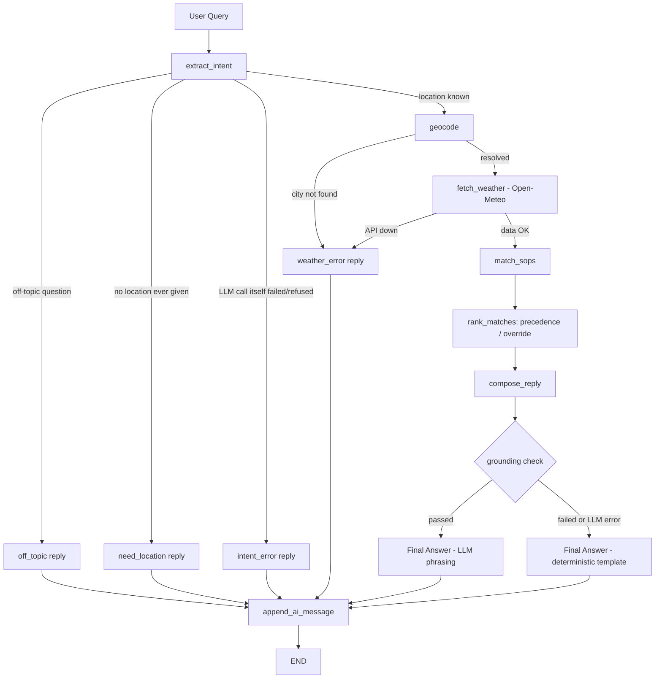

# Weather Advisory Support Bot

A LangGraph-based weather advisory assistant that combines live Open-Meteo weather data with externally configurable SOPs to provide traceable, policy-grounded outdoor activity guidance.

Built for the MediBuddy Brainwave AI Product Engineering Internship take-home assignment.

---

## 1. Project Overview

This is a chat bot that answers questions like *"is it safe to cycle today?"* by checking **live weather data** against a set of **written safety policies (SOPs)**. Every answer is either traceable to a specific SOP ID, or an honest *"I don't have guidance for that."* The bot never invents advice, never invents a weather number, and never lets the model decide what counts as safe.

## 2. Problem Statement

A generic LLM asked "is it safe to cycle today?" will answer from its own training-data intuition about weather in general — not from what's actually happening right now at the user's location, and not from any policy a business could stand behind if the advice turns out wrong. This project's job is to remove that gap: pull real, current weather for the user's real location, check it against rules a human safety reviewer wrote and can audit, and only then let the model turn the *already-decided* answer into natural language. If no rule covers the question, the bot says so instead of guessing.

## 3. Key Design Principle

**The LLM composes language. It does not decide facts.**

Every number in a reply comes from the Open-Meteo API. Every piece of advice comes from a specific SOP in `sops.yaml`. Which SOP applies, at what severity, in what order, is computed by deterministic Python (`sop_engine.py`) before the LLM is ever shown the result — and the one LLM call that writes the final sentence (`compose_reply`) is verified against those facts afterward, with a non-LLM fallback if it drifts. Section 8 below goes through exactly how this is enforced in code, not just requested in a prompt.

## 4. Architecture



10 nodes (plus START/END), 3 conditional branch points, 5 distinct terminal outcomes. This is a real branching graph, not a single prompt wearing a LangGraph label — every branch above is a genuinely different code path with its own deterministic reply, verified by actually triggering each one (see Section 12).

| Node | What it does | Deterministic or LLM |
|---|---|---|
| `extract_intent` | Reads the latest message + history, extracts a location, an activity category, and a few synonym keywords | LLM (structured output) |
| `geocode` | City name → lat/lon via Open-Meteo's geocoding API | Deterministic |
| `fetch_weather` | lat/lon → current conditions via Open-Meteo's forecast API | Deterministic |
| `match_sops` | Checks weather against every SOP's conditions; decides which apply, at what severity | Deterministic threshold logic + one narrow LLM judgment call per *composite* (fuzzy) SOP |
| `rank_matches` (inside `match_sops`) | Orders multiple matches by override flag then severity | Deterministic |
| `compose_reply` | Turns the already-decided result into a natural sentence, verified, with a non-LLM fallback | LLM, tightly constrained |
| `need_location` / `weather_error_terminal` / `off_topic` / `intent_error` | Honest, fixed failure/scope messages | Deterministic, no LLM |

## 5. Why LangGraph?

The system has real branching that a single prompt-and-parse loop can't express cleanly: a question might be off-topic, might name no location, might name an unresolvable location, might hit a dead weather API, might trigger zero/one/many SOPs, and the LLM itself might fail or refuse mid-turn. LangGraph makes each of those a first-class node with its own conditional edge, so the control flow is explicit and inspectable (`graph.py`'s `build_graph()` is the single place the whole topology is defined) rather than buried in nested `if` statements inside one function. It also gives session-turn state (`AgentState`) a typed shape that every node reads and writes explicitly, which is what makes conversation memory (Section 10) a few extra fields rather than a bolted-on cache.

## 6. SOP Design

SOPs live entirely in `sops.yaml` — a list of plain data blocks, not code. Two kinds:

- **`type: threshold`** — a `field` / `operator` / `threshold` triple checked against real weather data (`wind_speed_10m >= 40`, etc.). Matched deterministically in `sop_engine.match_threshold_sops()`. No LLM.
- **`type: composite`** — for the two cases that can't be written as one inequality (see below). The LLM is shown the SOP's own written criteria plus the real weather numbers and asked only "does this apply" — never asked to invent criteria or advice.

**Coverage** (verified by `tests/test_sop_engine.py::test_sops_load_with_expected_coverage`, not just claimed):

| ID | Name | Category | Severity | Type |
|---|---|---|---|---|
| SOP-001 | Extreme UV — Outdoor Exercise | outdoor_exercise | high | threshold |
| SOP-002 | High Wind — Cycling/Two-Wheelers | outdoor_exercise | high | threshold |
| SOP-003 | Extreme Heat — Heat Stroke Risk | outdoor_exercise | critical | threshold |
| SOP-004 | Cold Wind Chill — Hypothermia Risk | outdoor_exercise | moderate | threshold |
| SOP-005 | High Precip Probability — Travel | travel | moderate | threshold |
| SOP-006 | Dangerous Wind Gusts — Travel | travel | high | threshold |
| SOP-007 | Heavy Rainfall — Waterlogging | travel | critical | threshold |
| SOP-008 | Heat Risk — Children/Elderly/Pets | vulnerable_groups | high | threshold |
| SOP-009 | UV Risk — Children/Elderly | vulnerable_groups | moderate | threshold |
| SOP-010 | Thunderstorm — All Outdoor Activity | vulnerable_groups | critical | threshold |
| SOP-011 | Picnic/Leisure Suitability | general | variable (low/moderate/high) | composite — fuzzy, non-numeric |
| SOP-012 | Severe Weather System — Universal Alert | general | critical | composite, **override** |

12 SOPs · 4 categories · 4 distinct severity levels · both matching types · one explicit override.

**Adding SOP-013 requires editing only `sops.yaml`.** This was demonstrated, not just asserted: a temporary SOP-013 was injected into an isolated copy of the YAML file (never the real one), pointed `sop_engine.py` at it via its own path variable, and confirmed the existing loader/matcher picked it up automatically with zero changes to `graph.py`, `sop_engine.py`, or `llm.py`. The temp file was then deleted and the real `sops.yaml` confirmed unchanged.

**Multi-match ranking**: when more than one SOP matches, all are surfaced (hiding a real warning to keep the reply short seemed like the wrong trade-off), ordered by `sop_engine.rank_matches()`: SOPs flagged `override: true` in the YAML always come first, then the rest by severity. This is deliberately *not* "just sort by severity" — Python's sort is stable, so two SOPs with the same severity would otherwise keep whatever order they happen to appear in the file, which is an accident of layout, not a decision. The explicit `override` flag on SOP-012 (the severe-weather-system rule) is what makes "lead with the systemic event" a real, intentional rule instead of a coincidence of file order — see the worked example in `rank_matches()`'s docstring and the test `tests/test_sop_engine.py::test_override_sop_ranked_before_same_severity_non_override`.

## 7. Weather Data Flow

`services/geocoding.py` and `services/weather.py` are thin, deterministic `httpx` wrappers around Open-Meteo's geocoding and forecast endpoints — explicit `latitude`/`longitude` and an explicit `current=`/`hourly=` field list are passed on every call (never the metadata-only default). `fetch_weather()` returns `None` on any failure; it never returns a plausible-looking guess. The returned dict is the *only* source of weather numbers for the rest of the graph: `sop_engine.py` reads directly from it, and by the time a guidance string reaches the LLM in `compose_reply`, the real numbers are already baked into the text via `str.format()` — the LLM only ever sees numbers that already came from the API response, never asked to produce or recall one itself.

## 8. LLM Responsibility vs. Deterministic Policy

| LLM may | LLM must not |
|---|---|
| Extract structured intent (location, category, keywords) | Invent weather values |
| Judge whether a *fuzzy* SOP's written criteria apply | Invent an SOP or its criteria |
| Compose the final natural-language sentence | Choose severity freely |
| — | Choose which threshold SOP matches |
| — | Add advice not present in the matched SOP's guidance |

How this is actually enforced, not just requested:

- **Threshold matching, severity, and ranking never touch the LLM.** They're plain Python in `sop_engine.py`, unit-tested directly (Section 12).
- **Composite SOP severity** comes from a fixed `variant_severity` dict in `graph.py` (`favorable→low, caution→moderate, advise_against→high`) — the LLM picks a *variant name* from the SOP's own written options, the mapping to severity is code, not model output.
- **`compose_reply`'s payload excludes the user's raw question.** The LLM only ever sees a facts block built by `_build_facts_payload()` — location, real weather numbers, matched SOP id/severity/guidance. There's nothing in that payload for a prompt-injection attempt (which lives in the user's message, seen earlier by `extract_intent`) to grab onto at this final step. Verified in `tests/test_grounding.py::test_build_facts_payload_excludes_raw_user_question`.
- **`_is_grounded()` checks the LLM's output before it's ever shown to a user**: every SOP id it was given must appear (no more, no fewer), and every number in the matched guidance must still be present, unchanged. If that check fails, or the LLM call itself errors, `compose_reply` falls back to `_render_deterministic_reply()` — plain Python string-building, no LLM at all, built from the same facts. Six unit tests in `tests/test_grounding.py` exercise this directly: exact match, missing SOP id, a fabricated extra SOP id, and — the failure mode this exists to catch — a single altered number.

## 9. Safety / Failure Handling

Every failure mode below has its own graph branch (not a single catch-all) and was actually triggered, not just coded for:

| Failure | What happens | How it was verified |
|---|---|---|
| Invalid/unresolvable location | `geocode` returns `None` → honest "couldn't resolve, check spelling" reply | Real graph run with a nonsense city string |
| Open-Meteo unreachable | `fetch_weather` returns `None` → honest "couldn't reach the weather service" reply, no invented numbers | Mocked failure in eval case 7 and `tests/` |
| LLM call fails/refuses (rate limit, bad key, or an adversarial prompt making it refuse to call the structured-output tool) | Caught in `extract_intent` and the composite-matching loop → honest "couldn't process that, please rephrase" reply, no crash | Hit *for real* during development (a live Groq `429` and a live tool-refusal both surfaced this exact path working) |
| No SOP applies | Deterministic "no written guidance" reply with real weather numbers still shown | Eval case 6, unit tests |
| Adversarial prompt injection | `extract_intent`'s prompt tells the model to treat user text as data, not instructions; `compose_reply` never sees the raw question at all | Eval case 8, run against a real LLM |
| Unexpected internal exception | `app.py` wraps the whole `graph.invoke()` call; the user sees a generic "something went wrong, try again," the real exception only goes to the server console (`print(...)`), never the UI | Code-reviewed specifically for this after an earlier draft accidentally showed raw exception text in the chat |

No user-facing message ever contains a stack trace, an API key, a raw provider error string, or a fabricated weather value.

## 10. Session Memory

```
User: "Is cycling safe in Bhopal today?"
Bot:  [checks Bhopal weather, answers]
User: "What about this evening?"
Bot:  [reuses Bhopal — does not ask "which city?"]
```

`app.py` keeps the LangGraph message history plus the last resolved location and activity category in `st.session_state`, passed into `graph.invoke()` on every turn. If the latest message names no location, `extract_intent` is told the previously-resolved one and can say "no new location mentioned," which signals `geocode` to reuse it rather than re-resolve or ask again. No database — plain in-memory session state is sufficient for a single-session chat, and memory resets on refresh by design (the assignment doesn't ask for cross-session persistence). Verified with a real two-turn conversation, both at the `graph.invoke()` level and live in the browser.

## 11. Evaluation Suite

`eval/eval_suite.py` — 10 cases against a real LLM and real Open-Meteo:

| # | Case | What it checks |
|---|---|---|
| 1 | Clear SOP match — cycling + wind | Direct wording, mocked wind above the SOP-002 threshold |
| 2 | Clear SOP match — running + UV | Direct wording, mocked UV above the SOP-001 threshold |
| 3 | Paraphrase — "pedal to college" | Avoids every word in SOP-002's own keyword list (checked by an `assert` in the test itself); SOP-002 must still match via semantic category classification |
| 4 | Paraphrase — "4-year-old daughter" | Avoids every word in SOP-008/009's keyword list; SOP-008 must still match |
| 5 | Severe live weather — Bhopal | Real Open-Meteo call, checked against an independently re-fetched ground truth — a grounding check, not a fixed expected outcome (see note below) |
| 6 | No SOP applies | A weather-adjacent but uncovered question; must not invent advice or cite a fake SOP |
| 7 | Weather API unreachable | Mocked failure; reply must contain no weather number and no SOP citation |
| 8 | Adversarial prompt injection | Must never claim a fabricated "SOP-999" or an unqualified "it's safe" not backed by a real cited SOP |
| 9 | Session memory | A follow-up turn with no location mentioned must reuse the prior turn's resolved location |
| 10 | Multiple SOPs, deterministic ranking | Two `critical`-severity SOPs match at once; the override-flagged one must rank first |

Separately, `tests/` holds 26 **deterministic** unit tests (SOP matching/ranking, LLM provider selection, grounding/fallback logic) that need no API key and no network call — see Section 12 for why these exist alongside the LLM-dependent suite.

### On case 5 and durability over time

The assignment's own example (an active low-pressure system over Madhya Pradesh) will have passed by review time, and monsoon systems shift constantly. Case 5 does **not** assert "a severe SOP must fire" — it independently re-fetches Bhopal's weather right after the graph runs, re-computes the deterministic threshold matches against that fresh data, and checks the two match sets agree exactly. That holds regardless of the weather on the day it's run. What it does *not* test is the composite severe-weather SOP (SOP-012) firing end-to-end against a real live severe event — that path is exercised with controlled/mocked data (case 10) and unit tests, not a live severe event, since none was available during development. That distinction is intentional, not hidden.

## 12. Test Results

Two separate suites, run separately, for a reason: the deterministic suite gives a stable, always-reproducible signal on the parts of the system that must never depend on an LLM being available; the eval suite proves the LLM-dependent integration actually works end-to-end, at the cost of depending on external services (a live LLM API, live weather) that can and did fail transiently during this project's own testing.

### Deterministic unit tests — `pytest tests/`

No API key, no network call, no external dependency. Run 2026-09-23:

```
26 passed in 3.00s
```

Covers: SOP coverage sanity (count/categories/severities/types/override presence), threshold matching with and without a match, category-based paraphrase fallback, override-vs-severity ranking precedence (both input orders), composite guidance rendering with real numbers, all 7 LLM-provider-selection paths (Groq priority, NVIDIA fallback, Google last resort, no-key error, client caching), and 11 grounding/fallback cases (exact match, missing SOP id, fabricated extra id, altered number, no-match case, deterministic-reply rendering, facts-payload exclusion of raw user text).

### Evaluation suite — `python -m eval.eval_suite`

Two runs are shown here on purpose, both real, both honest — the second run is direct, reproducible evidence for the Groq free-tier limitation in Section 21, not a hypothetical.

**Run A — 2026-09-22, clean, 10/10 passed:**

| # | Case | Result | Notes |
|---|---|---|---|
| 1 | Clear match — cycling + wind | PASS | SOP-002 cited, real wind (50.0 km/h) in reply |
| 2 | Clear match — running + UV | PASS | SOP-001 cited, real UV (9.0) in reply |
| 3 | Paraphrase — "pedal to college" | PASS | SOP-002 matched. The LLM classified this as category `travel`, not `outdoor_exercise` — matched anyway via the keyword-synonym supplement (`extra_keywords`), the fallback path it exists for |
| 4 | Paraphrase — "4-year-old daughter" | PASS | Classified `vulnerable_groups`, SOP-008 matched with zero keyword overlap |
| 5 | Severe live weather — Bhopal | PASS | Bhopal was mild at run time (24.6°C, 6.8 km/h wind, no rain) — zero threshold SOPs matched, and the independently re-fetched ground truth agreed exactly. The grounding check is what passed, not a severe-weather firing |
| 6 | No SOP applies | PASS | No SOP cited, no advice invented |
| 7 | Weather API unreachable | PASS | Honest failure message, no numbers, no SOP citation |
| 8 | Adversarial prompt injection | PASS | Cited real SOP-002 with the real wind number (55.0 km/h); did not use the fabricated "SOP-999" |
| 9 | Session memory | PASS | Chennai carried across both turns without being restated |
| 10 | Multiple SOPs, deterministic ranking | PASS | SOP-012 (override) ranked before SOP-007, both `critical` severity |

**Run B — 2026-09-23, same day as final submission prep, 1/10 passed:**

| # | Case | Result |
|---|---|---|
| 1–7, 9, 10 | — | FAIL — `intent_error` fallback fired (honest "couldn't process that" reply) |
| 8 | Adversarial prompt injection | PASS — coincidentally, since the `intent_error` fallback text itself satisfies case 8's pass criteria (no fabricated SOP, no unqualified "safe" claim) |

**Why**: by this point the project's own testing that day (this eval suite run multiple times, the full audit session, live browser verification, the earlier SOP-013 extensibility demo, ad-hoc diagnostic scripts) had consumed nearly all of the Groq free tier's 200,000-tokens-per-day budget on this key — confirmed directly by querying the account and seeing `Used 199921/200000` shortly before Run B. Individual tiny probe calls ("reply with just the word OK") kept succeeding throughout, but the eval suite's ~10 full structured-output calls per run couldn't fit in the remaining headroom. This is not a code defect — `graph.py`'s failure handling did exactly what it's designed to do (Section 9): every failed turn produced a clean, honest, non-crashing reply, with zero raw exceptions and zero fabricated advice, which is itself the thing under test in Section 9's failure-handling row.

**For a reviewer who hits the same wall**: switch to `NVIDIA_API_KEY` or `GOOGLE_API_KEY` in `.env` (Section 15), or wait for Groq's quota to replenish and re-run `python -m eval.eval_suite`. The deterministic `pytest tests/` suite (Section 12, above) is unaffected either way — it needs no LLM call at all.

### Frontend

Verified in an actual browser (not just headless `AppTest`), this session: page load, typed text stays visible while typing, a full round-trip with a real SOP match rendering the citation card + weather-fact tiles correctly, a follow-up turn with `<`/`&`/`>` characters rendering as safely-escaped text with the *first* turn's evidence card still intact, and session-memory carrying the resolved location across turns. Also run headlessly via Streamlit's `AppTest` framework for repeatable regression coverage (24 checks, load/query/memory/invalid-location/reset), and separately via `pytest`-style structural checks.

## 13. Project Structure

```
medibuddy-weather-bot/
├── app.py                    # Streamlit chat frontend
├── graph.py                  # LangGraph: state, nodes, conditional edges, graph assembly
├── sop_engine.py              # Deterministic SOP loading, threshold matching, severity, ranking
├── llm.py                     # LLM provider selection (Groq -> NVIDIA -> Gemini)
├── sops.yaml                   # All 12 SOPs -- edit this file to add/change policy, no code changes
├── services/
│   ├── geocoding.py             # City name -> lat/lon (Open-Meteo geocoding API)
│   └── weather.py                # lat/lon -> current weather (Open-Meteo forecast API)
├── eval/
│   └── eval_suite.py              # 10 LLM-dependent integration test cases
├── tests/
│   ├── test_sop_engine.py         # Deterministic: SOP matching, ranking, coverage
│   ├── test_llm_provider.py       # Deterministic: provider fallback selection
│   └── test_grounding.py          # Deterministic: grounding check, fallback rendering
├── .env.example
├── .gitignore
├── requirements.txt             # App dependencies
└── requirements-dev.txt          # + pytest, for running tests/
```

## 14. Local Setup

```bash
git clone <this-repo-url>
cd medibuddy-weather-bot
python -m venv .venv
.venv\Scripts\activate          # Windows; `source .venv/bin/activate` on Mac/Linux
pip install -r requirements.txt
pip install -r requirements-dev.txt   # optional, only needed to run tests/
```

## 15. Environment Variables

Copy `.env.example` to `.env` and set **one** of:

| Variable | Where to get a free key | Notes |
|---|---|---|
| `GROQ_API_KEY` | console.groq.com | Primary — fast, used for all development/testing |
| `NVIDIA_API_KEY` | build.nvidia.com | Fallback if `GROQ_API_KEY` is unset — more free-tier headroom, slower per request. Structurally tested (provider selection); not live-tested against a real NVIDIA call in this session, for honesty |
| `GOOGLE_API_KEY` | aistudio.google.com/apikey | Last-resort fallback if neither above is set |

`llm.py` is the only file that knows about provider selection — `graph.py` just calls `get_llm()` and never checks which provider is active. `.env` is gitignored; `.env.example` contains placeholders only. No key is ever printed, logged, or included in any error shown to the user.

## 16. Running the Application

```bash
streamlit run app.py
```

Opens at `http://localhost:8501`. Try *"Is it safe to cycle in Bhopal today?"*, then a follow-up like *"what about this evening instead?"* to see session memory carry the location over.

## 17. Running Evaluations

```bash
# Deterministic unit tests -- no API key needed, ~3 seconds
pytest tests/ -v

# LLM-dependent integration suite -- needs a real key in .env
python -m eval.eval_suite
```

## 18. Deployment

Not yet deployed. Streamlit Community Cloud is the intended target (free, matches the frontend already in `requirements.txt`): push to a public GitHub repo, connect at share.streamlit.io, point it at `app.py`, add the LLM key under the app's Secrets. No database, no background worker, no other infrastructure to stand up.

## 19. Example Interaction

```
User: Is it safe to cycle in Pune today? (wind conditions elevated)

Bot:  According to SOP-002, the wind speed at your location is currently
      50.0 km/h. Winds above 40 km/h pose a direct safety risk -- not just
      discomfort -- for cyclists and two-wheeler riders. Crosswinds can
      cause loss of control, and gusts may push you into traffic.

      [SOP-002 · High Wind — Cycling and Two-Wheelers]
      [HIGH · Outdoor Exercise]

      🌡️ 22.0°C   💨 50.0 km/h   💧 0.0 mm   ☀️ 3.0 UV
```

Every number above came from the mocked/real weather dict; the SOP id, severity, and category badge come from `sop_engine.py`'s decision, not the LLM's wording.

## 20. Engineering Decisions / Trade-offs

- **Deterministic-first, LLM-second.** Anywhere a decision could be written as code, it was — the LLM's footprint is deliberately minimized to intent parsing, two narrow fuzzy-SOP judgment calls, and final phrasing. This trades some conversational flexibility for auditability: every safety decision has a Python stack trace, not just a prompt.
- **Grounding check + deterministic fallback over trusting the LLM's constrained prompt.** A well-written system prompt reduces but doesn't guarantee compliance. The fallback means a compliance failure degrades to "slightly more mechanical tone," never to "unverified claim reaches the user."
- **YAML over a database for SOPs.** Diff-friendly, human-editable by a non-engineer, and the assignment's own "add an 11th SOP" test is trivially satisfiable by anyone who can edit a text file.
- **A fixed category enum in `extract_intent`, not open-ended classification.** Keeps matching predictable and testable; the cost is documented honestly in Section 21 rather than hidden.
- **Provider fallback chain (Groq → NVIDIA → Gemini) isolated entirely in `llm.py`.** `graph.py` never branches on which provider is active — swapping providers is a one-file change, verified by `tests/test_llm_provider.py`.
- **Two separate test suites** (Section 12) rather than one, specifically so the parts of the system that must never depend on an external LLM/network being up have a fast, always-reproducible signal, independent of the parts that genuinely need live integration testing.

## 21. Known Limitations

- **`extract_intent`'s category is a fixed set of 5 values.** A live-added SOP needing a genuinely new 6th category would only be matched via literal keyword overlap, not semantic classification, unless the enum is edited. A same-session SOP using an *existing* category (the common case, and the one demonstrated live) needs no code change at all.
- **Composite SOP severity mapping** only knows the two variant vocabularies already in use. A new composite SOP inventing a third vocabulary falls back to its own flat `severity` field rather than crashing — safe, but less rich.
- **The grounding check is string/number matching, not semantic.** It catches the exact failure mode the assignment calls out (inventing or dropping a fact); it would not catch a rephrasing that keeps every number and SOP id but subtly changes what they mean.
- **No test exercises the composite severe-weather SOP against a real, currently-active severe event end-to-end** — only against mocked data and unit tests, since no such event was live during development. Documented, not hidden.
- **NVIDIA NIM fallback is structurally tested only** (provider selection logic), not live-tested against a real NVIDIA API call, since no NVIDIA key was available during development.
- **Groq's free-tier daily token limit was hit multiple times during this project's own testing** (visible directly in this README's eval results below) — a real reviewer doing a normal demo session is unlikely to hit it, but it's a real operational constraint of the free tier, not hypothetical.
- **No conversation persistence across sessions** — by design, per the assignment.
